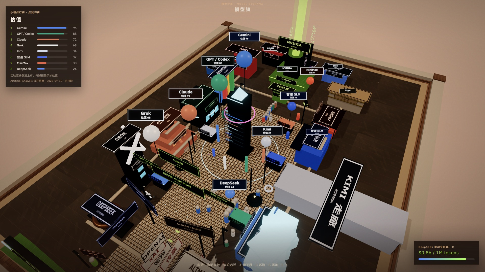

# 模型镇

一座用 Three.js **纯代码**搭的 AI 夜市沙盘。线上： [grok-ai-town.01mvp.com](https://grok-ai-town.01mvp.com)



西岸是 Claude / GPT·Codex / Gemini / Grok，东岸是 DeepSeek / Kimi / 智谱 / MiniMax，北面所有人给英伟达交 CUDA 税。广场中央立排行榜方尖碑，角落有奥特曼 vs 马斯克的法庭，DeepSeek 门口挂着滑动变阻器。

观感是诚实的：**好玩的点子在，完成度一般。** 积木感重，光和比例叠了七十刀还是沙盘，不是精致场景。适合当一次「提示词 + 通宵 loop」的实验记录，不适合当 Three.js 示范项目。

## 本地跑

```bash
npm install
npm run dev
```

打开终端里的地址（默认 `http://localhost:5174`）。

- **V** 斜俯（默认，拖动旋转 / 滚轮远近 / 右键平移）
- **C** 巡游 · **G** 落地走路 · **F** 电影镜头飞
- **L** 或点左上角：切排行榜（智力 / 用户 / 估值 / 性价比 / 开源 / 上下文）
- **R** 或点滑动变阻器：拧 DeepSeek 的价格
- 点击建筑看牌子

栈：Vite + vanilla Three r174 + UnrealBloom + OutputPass。形体只许 box / cylinder / cone / sphere / torus / capsule / plane。**零 GLB**，字用 Canvas 2D 画。

部署：`npm run build && npx wrangler deploy`（Cloudflare Workers 静态资源，绑 `grok-ai-town.01mvp.com`）。

## 这是一次什么实验

2026-08-15，从凌晨 01:19 做到下午约 14:40（UTC+8），大约 **13.5 小时**，loop **tick 0–69**。人说停才停。

目标不是复刻一张截图，而是按 [techartist_ 这条推](https://x.com/techartist_/status/2077433800276283523) 的思路：先定世界和积木语言，再搭能认出来的形体，然后用小步迭代推光、比例和「好玩的一拍」。姐妹仓调研在 `01mvp/grok-town/docs/research-chinatown.md`（唐人街夜市同一套积木，换主题）。本题蓝图见 [`docs/blueprint.md`](docs/blueprint.md)。

排行榜里智力 / 性价比 / 开源 / 上下文会拉 [Artificial Analysis](https://artificialanalysis.ai/) 的公开快照（jsDelivr，TTL 6h）；用户和估值仍是手抄夜市传言，不是财报。

## 原始提示词

当时原话，未改：

> 新建一个文件夹 , https://x.com/techartist_/status/2077433800276283523 参考这个推文 帮我尝试复刻一个小镇，什么都行，只要好看好玩，
>
> 基于threejs， 你应该先好好调研一下，基于这个推文给的思路，必要的时候还可以搜索一些其他成功的“方法论”/skill 之类的 再开始执行
>
> 我想做一个有趣的 AI 小镇！！ 有 Claude / Codex / 智谱 / deepseek / Gemini / Grok / Kimi  等等  ，还有英伟达，美国或者中国的芯片公司等等
>
> 用生动形象的方式实现他们之间的有趣故事和对比，用各种形象化好玩的方式，比如智力，用户数量，企业估值，代表人物，logo 等等，尽可能好玩有趣一点。比如还有小镇排行榜，他们之间的斗争（比如 奥特曼/马斯克的法庭斗争之类的）， Deepseek 的滑动变阻器...
>
> 另外 这个是另外一个 AI 调研的结果： /Users/jackiexiao/code/01mvp/grok-town/docs/research-chinatown.md 供参考， 你仔细思考一下怎么做，而且建议你做合理的 Loop 迭代设计，也就是完成初版功能之后，不断做迭代（我没有让你停下来之前不要停止这个 Loop），开始吧！期待你十几小时后做出一个有趣的 AI小镇

## 怎么做的（可复刻）

1. **先调研再写代码。** 读源推文的构图/积木思路，对照姐妹仓的唐人街调研，写一页蓝图：南门 → 广场方尖碑 → 北侧芯片厂；西美东中；法庭、变阻器、排行榜必须进第一版。
2. **锁死资产约束。** 100% procedural，禁止 GLB。不然 loop 会变成「下模型、调材质」，小镇会散。
3. **先能逛，再好看。** tick 0 就要有门、两边实验室、芯片厂、法庭、变阻器、排行榜、气球。后面每一刀只改一件事。
4. **Loop 协议**（原文在 [`docs/loop.md`](docs/loop.md)）：
   - 截一张巡游、一张斜俯
   - 对照参考图，挑最丑或最空的一块
   - 只改比例 / 摆位 / 光和 bloom / 一个好玩的拍 / 减噪，五选一
   - 在 [`docs/loop-log.md`](docs/loop-log.md) 追加三行
   - 约 8 分钟醒一次，人没说停就不要停
5. **好玩优先于写实。** 估值变成气球体积，开源变成围栏漏洞，DeepSeek 价格变成滑动变阻器，CUDA 税排成北岸队伍。数字对不上财报没关系，观众要能指着说「这是啥」。

别人要复刻：把上面那段提示词丢给能改代码、能截浏览器、能定时醒的 agent，再把 `docs/loop.md` 当作系统约束。准备好十几个小时和一份「看起来还是沙盘」的心理预期。

## 时间线

| 时间 (UTC+8) | 发生了什么 |
| --- | --- |
| 01:19 | 原始提示词；调研 techartist + 唐人街文档；写蓝图 |
| ~01:40 | tick 0：可逛的初版（门、广场、实验室、芯片厂、法庭、变阻器、榜） |
| 01:40–14:37 | tick 1–69，约 8 分钟一刀：NVIDIA 灯塔、Kimi 走廊、开源围栏、bloom 减噪、巡游路径、招牌可读性… |
| ~14:37 | 人说停。默认镜头从巡游改成 45° 东南斜俯 |
| ~14:55 | 截图进 README，绑 `grok-ai-town.01mvp.com`，仓库公开 |

七十刀里大量时间花在「从南门能认出英伟达」「法庭飞纸能读」「气球别挡住榜」这种可读性上。没有出现突然变精致的拐点。

## 局限

- 仍是 low-poly 盒子镇，和源推文的精致感有明显差距。
- 用户 / 估值是手抄，不是实时数据。
- HMR 热更 `town.js` / `buildings.js` 一类文件可能弄死 WebGL，需要硬刷新。
- 没有物理、没有真正的 NPC AI，人只是胶囊在巡逻。
